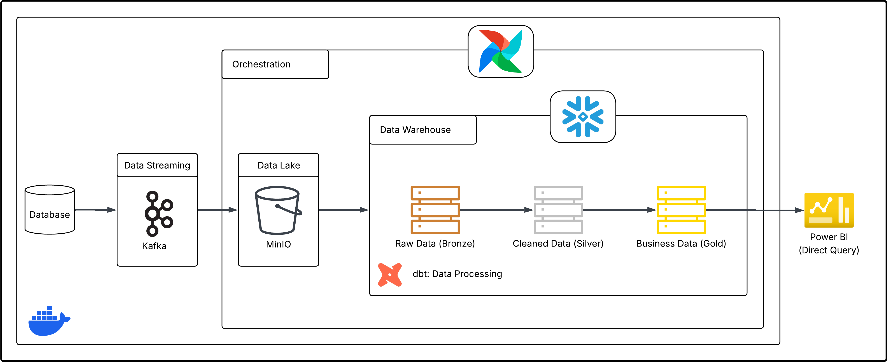
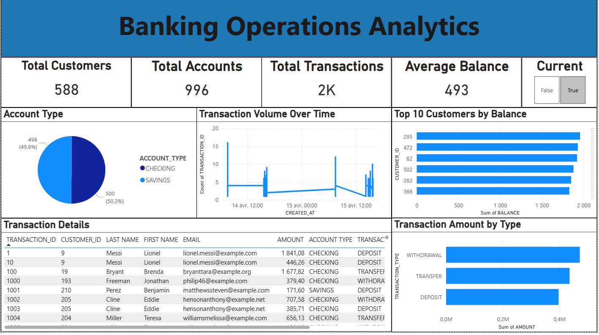

# 🏦 Banking Data Engineering Project

A complete, end-to-end data pipeline focused on the banking sector. This project generates simulated data for customers, accounts, and transactions, streams these changes in real time, and transforms them into models ready for analytics. The final output is visualized in a Power BI dashboard.

## 🛠️ Tech Stack


## 🏗️ Architecture



**How the pipeline works:**
1. **Data Generator**: A Python app using Faker simulates banking activity (transactions, accounts, and customers) and writes to Postgres.
2. **Kafka + Debezium**: Captures changes (CDC) from Postgres in real time and streams them into MinIO (S3-compatible storage).
3. **Airflow**: Orchestrates the workflow, loading data into Snowflake.
4. **Snowflake**: Acts as our Cloud Data Warehouse, organizing data into Bronze, Silver, and Gold layers.
5. **dbt**: Handles data transformations, builds data marts, and manages snapshots (SCD Type-2).
6. **CI/CD**: GitHub Actions automates testing and deployment processes.

## 📂 Project Structure

```text
├── .github/              # GitHub Actions workflows for CI/CD
├── banking_dbt/          # dbt project and models
├── consumer/             # Code for Kafka consumer
├── data-generator/       # Scripts to generate mock banking data
├── docker/               # Dockerfiles and related config
├── kafka-debezium/       # Kafka and Debezium CDC configuration
├── postgres/             # Database initialization scripts
├── docker-compose.yml    # Services orchestration
├── requirements.txt      # Python dependencies
```

## 📊 Dashboard

Here is the Power BI dashboard visualizing the banking operations:


